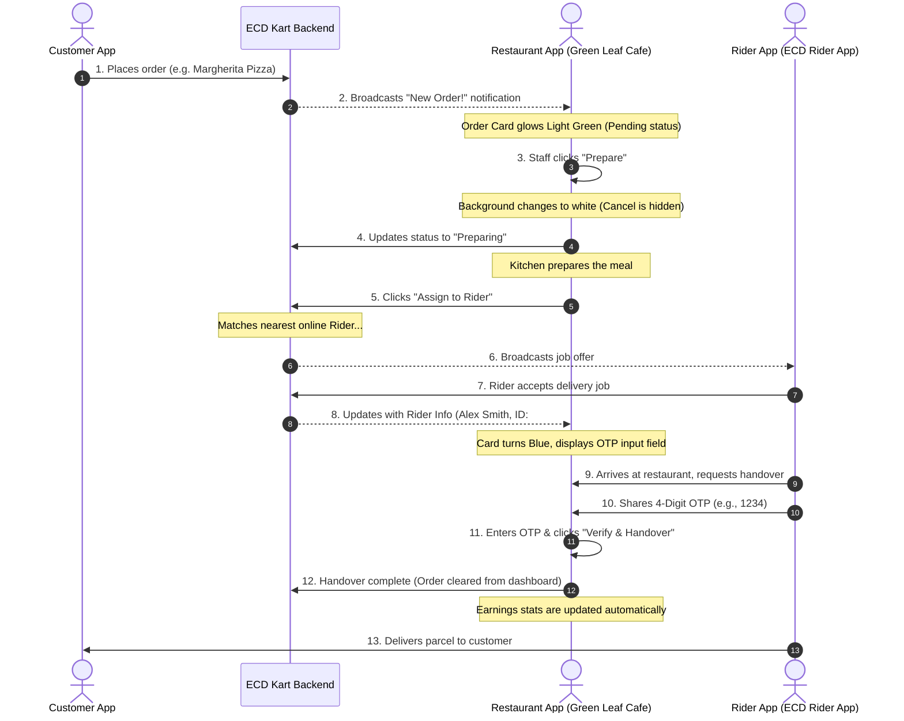

# ECD KART RESTAURANT APP

A premium, modern Flutter-based restaurant management application for the **ECD KART** delivery ecosystem. This app enables restaurant owners to manage incoming orders, track kitchen preparation, assign delivery riders, and verify secure pick-ups using OTP handovers.

---

## 🔄 ECD KART Delivery Ecosystem Flow (Complete Cycle)

This application is one of the three core pillars of the ECD KART ecosystem (Customer, Restaurant, Rider). Below is the comprehensive flowchart showing how an order moves through the system, how riders are matched, and how the handover is verified:




---

## 🌟 Key Features & Interface Highlights

### 1. 🛡️ Secure 14-Digit Key Authentication
Instead of relying on fragile email/password combinations, restaurant managers log in securely using a uniquely generated **14-digit restaurant key** representing their branch.

### 2. 🟢 Live Availability & Status Toggle
*   **Online/Offline Switch**: Toggling this button closes the restaurant. In offline mode, the dashboard locks down, displaying a closed storefront, and food becomes unpurchasable for customers.
*   **Smart AppBar Contrast**: The online switch is explicitly styled in dark green and white so it pops perfectly and remains highly visible against the emerald header.

### 3. 🍲 Intuitive Order Pipeline
*   **Pending (New Order)**: Glowing green background alert. Chefs can review special instruction notes (e.g., "No onions", "Make it spicy"). Action buttons: **Cancel** or **Prepare**.
*   **Preparing**: Background turns white, the "Cancel" option is removed to prevent accidental kitchen dropouts, and state shifts to "Preparing". Action button: **Assign to Rider**.
*   **Assigning Rider**: Initiates the rider dispatch sequence. It displays a loading spinner with a "Finding Rider..." label.
*   **Rider Assigned & OTP Handover**: Once a rider accepts, the card updates with a blue badge showing the rider's name and ID. Staff can enter the rider's unique 4-digit code into the OTP field and click **Verify & Handover** to finalize the order.

### 4. 📊 Performance Analytics & Dashboard
Tapping the profile icon opens the Restaurant's internal panel:
*   **Earnings Card**: Shows real-time metrics of **Total Completed Orders** and cumulative **Total Earnings**.
*   **Restaurant Details**: Custom branding with a dummy restaurant logo and phone number.
*   **Ecosystem Policies**: Easily accessible legal pages including **Order History** (month-by-month list of orders), **Terms & Conditions**, **Privacy Policy**, and **Payment Policy**.

---

## 🛠️ Architecture & Tech Stack

This project is built using:
*   **Flutter (Dart)** for the cross-platform framework.
*   **Clean MVC-style architecture** separating the `Order` data models from view screens.
*   **Stateful Widgets** to power local state updates (`setState`) for immediate real-time transitions (Pending $\rightarrow$ Preparing $\rightarrow$ Assigning $\rightarrow$ Handover).

---

## 📁 Directory Structure

```
lib/
│
├── main.dart                  # App initialization, main routes & green styling theme
├── models/
│   └── order_model.dart       # Order data model (ID, status, customer details, rider details)
└── screens/
    ├── login_screen.dart      # 14-Digit Key Authentication UI
    ├── dashboard_screen.dart  # Active orders list & online switch controller
    ├── profile_screen.dart    # Profile screen, stats overview & settings list
    ├── order_history_screen.dart  # Monthly orders ledger
    ├── terms_conditions_screen.dart # User terms & guidelines
    ├── privacy_policy_screen.dart # Data security policy details
    └── payment_policy_screen.dart # Settlement & Commission structures
```

---

## 💻 Setup & Installation

### Prerequisites
Make sure you have Flutter installed on your machine. You can verify this by running:
```bash
flutter --version
```

### Cloning and Running
Follow these steps to clone the repository and run the application locally:

1.  **Clone the Repository**
    ```bash
    git clone https://github.com/ashishwebintegratorz/ECD-RESTURENT-APP.git
    cd ECD-RESTURENT-APP
    ```

2.  **Install Dependencies**
    Get all the required packages:
    ```bash
    flutter pub get
    ```

3.  **Run the App**
    Launch the app on your connected device, emulator, or browser:
    ```bash
    flutter run
    ```
    *(Press `2` for Chrome, or `1` for Windows Desktop when prompted)*

4.  **How to Build (Optional)**
    To compile the project for production:
    ```bash
    flutter build web
    # or
    flutter build apk
    ```
